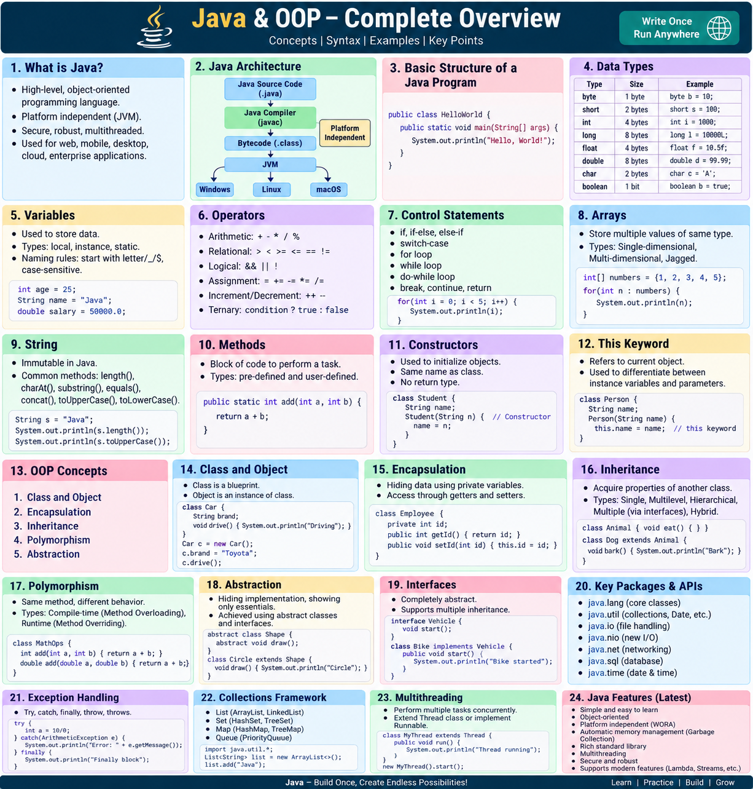

# Java & OOP - Complete Overview



This repository is a hands-on Java learning project covering the core fundamentals of Java programming and the major concepts of Object-Oriented Programming (OOP). It is designed for beginners, self-learners, and interview preparation.

## Why this repository?

- Learn Java from basics to advanced concepts
- Practice real code examples for each topic
- Understand OOP principles clearly
- Prepare for Java interview questions confidently
- Study in a simple and structured way

## Topics covered

1. What is Java?
2. Java Architecture
3. Basic Structure of a Java Program
4. Data Types
5. Variables
6. Operators
7. Control Statements
8. Arrays
9. String
10. Methods
11. Constructors
12. This Keyword
13. OOP Concepts
14. Class and Object
15. Encapsulation
16. Inheritance
17. Polymorphism
18. Abstraction
19. Interfaces
20. Key Packages & APIs
21. Exception Handling
22. Collections Framework
23. Multithreading
24. Java Features (Latest)

## Project structure

- [exampleOfJAVA](exampleOfJAVA) - Java examples and exercises
- [exampleOfJAVA/01_What_Is_Java](exampleOfJAVA/01_What_Is_Java) - Java introduction and fundamentals
- [exampleOfJAVA/02_Java_Architecture](exampleOfJAVA/02_Java_Architecture) - JDK, JRE, JVM, and execution model
- [exampleOfJAVA/03_Basic_Program](exampleOfJAVA/03_Basic_Program) - basic Java program structure
- [exampleOfJAVA/04_Data_Types](exampleOfJAVA/04_Data_Types) - primitive and non-primitive types
- [exampleOfJAVA/05_Variables](exampleOfJAVA/05_Variables) - variable declaration and usage
- [exampleOfJAVA/06_Operators](exampleOfJAVA/06_Operators) - arithmetic and logical operators
- [exampleOfJAVA/07_Control_Statements](exampleOfJAVA/07_Control_Statements) - if, switch, loops
- [exampleOfJAVA/08_Arrays](exampleOfJAVA/08_Arrays) - array operations
- [exampleOfJAVA/09_String](exampleOfJAVA/09_String) - string methods and operations
- [exampleOfJAVA/10_Methods](exampleOfJAVA/10_Methods) - reusable logic through functions
- [exampleOfJAVA/11_Constructors](exampleOfJAVA/11_Constructors) - object initialization
- [exampleOfJAVA/12_This_Keyword](exampleOfJAVA/12_This_Keyword) - current instance reference
- [exampleOfJAVA/13_OOP_Concepts](exampleOfJAVA/13_OOP_Concepts) - OOP overview
- [exampleOfJAVA/14_Class_and_Object](exampleOfJAVA/14_Class_and_Object) - class and object examples
- [exampleOfJAVA/15_Encapsulation](exampleOfJAVA/15_Encapsulation) - data hiding and access control
- [exampleOfJAVA/16_Inheritance](exampleOfJAVA/16_Inheritance) - parent-child class relationships
- [exampleOfJAVA/17_Polymorphism](exampleOfJAVA/17_Polymorphism) - method overloading and overriding
- [exampleOfJAVA/18_Abstraction](exampleOfJAVA/18_Abstraction) - abstract classes and methods
- [exampleOfJAVA/19_Interfaces](exampleOfJAVA/19_Interfaces) - interface-based design
- [exampleOfJAVA/20_Key_Packages_APIs](exampleOfJAVA/20_Key_Packages_APIs) - Java packages and libraries
- [exampleOfJAVA/21_Exception_Handling](exampleOfJAVA/21_Exception_Handling) - try/catch/finally
- [exampleOfJAVA/22_Collections_Framework](exampleOfJAVA/22_Collections_Framework) - List, Set, Map, Queue
- [exampleOfJAVA/23_Multithreading](exampleOfJAVA/23_Multithreading) - threads and concurrency basics
- [exampleOfJAVA/24_Java_Features_Latest](exampleOfJAVA/24_Java_Features_Latest) - modern Java updates

## Quick start

To compile and run any Java example:

```bash
javac <ClassName>.java
java <ClassName>
```

Example:

```bash
cd exampleOfJAVA/14_Class_and_Object
javac ClassAndObject.java
java ClassAndObject
```

## Core Java interview topics

- JDK vs JRE vs JVM
- Primitive vs reference types
- String immutability
- Static and final keywords
- Method overloading vs overriding
- Constructor usage
- Exception handling
- Collections and multithreading
- Encapsulation, inheritance, polymorphism, abstraction

## Common interview questions

### What is Java?
Java is a high-level, object-oriented, platform-independent language that runs on the JVM.

### What is OOP?
OOP is a programming approach where code is organized around classes and objects to improve reuse and structure.

### What is the difference between abstraction and encapsulation?
- Abstraction hides implementation details and exposes only the necessary behavior.
- Encapsulation keeps data and methods together and restricts direct access.

### Why is Java platform independent?
Because Java source code is compiled to bytecode, which runs on any machine with a JVM.

### What is the difference between method overloading and overriding?
- Overloading: same method name, different parameters in the same class
- Overriding: same method signature in the child class with different implementation

### What is an interface?
An interface defines a contract that a class can implement.

### What is exception handling?
Exception handling is the process of managing runtime errors using try, catch, finally, throw, and throws.

## Interview answer template

Use this structure when answering technical questions:

1. Define the concept clearly
2. Explain why it is used
3. Give a small example
4. Mention a real-world use case

Example:

> Encapsulation is the process of binding data and methods together inside a class and hiding the internal details. It helps protect data and makes programs easier to maintain.

## Purpose

This project is intended for practical Java learning, concept revision, and technical interview preparation. It helps bridge the gap between theory and coding practice.

## License

This repository is intended for educational and learning purposes.
